<div align="center">
  

  # Nodify

  **Automate. Connect. Create with AI-Powered Workflows**

  A powerful visual workflow automation platform built with Next.js, React Flow, and Firebase.

  [](https://www.typescriptlang.org/)
  [](https://nextjs.org/)
  [](https://reactjs.org/)
  [](https://firebase.google.com/)
  [](LICENSE)

  [🚀 Live Demo](#) · [📖 Documentation](docs/) · [🐛 Report Bug](https://github.com/nodify0/Nodify/issues) · [💡 Request Feature](https://github.com/nodify0/Nodify/issues)

</div>

---

## 📖 Table of Contents

- [Overview](#-overview)
- [Screenshots](#-screenshots)
- [Key Features](#-key-features)
- [Architecture](#-architecture)
- [Getting Started](#-getting-started)
- [Project Structure](#-project-structure)
- [Core Concepts](#-core-concepts)
- [Usage Examples](#-usage-examples)
- [Contributing](#-contributing)
- [License](#-license)

---

## 🌟 Overview

**Nodify** is a visual workflow automation platform (similar to n8n, Zapier, or Make) that enables users to build powerful automations through an intuitive canvas interface. Connect nodes to create workflows that can trigger webhooks, make HTTP requests, process data, interact with AI models, manipulate databases, and much more—all without writing complex code.

Built with modern web technologies, Nodify offers a seamless experience for creating, managing, and executing workflows with real-time debugging, AI integration, and secure credential management.

---

## 📸 Screenshots

### 🏠 Landing Page

<div align="center">
  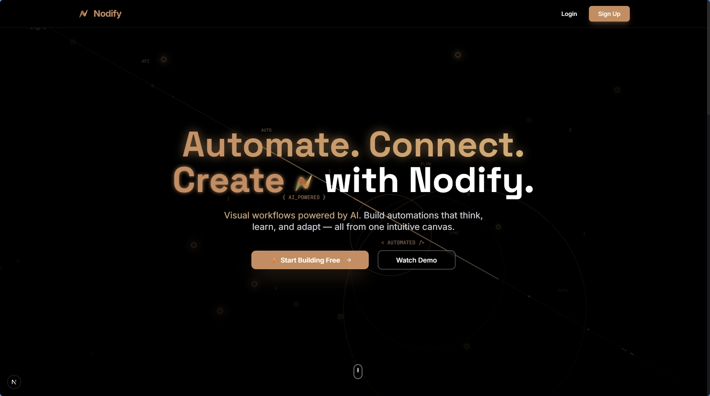
  <p><em>Welcome to Nodify - Visual workflows powered by AI. Build automations that think, learn, and adapt.</em></p>
</div>

---

### 🔐 Authentication

<div align="center">
  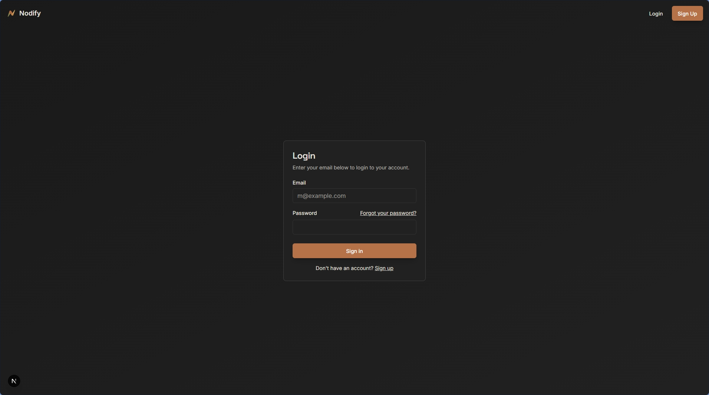
  <p><em>Secure authentication powered by Firebase Auth with email/password support.</em></p>
</div>

---

### 📊 Workflow Dashboard

<div align="center">
  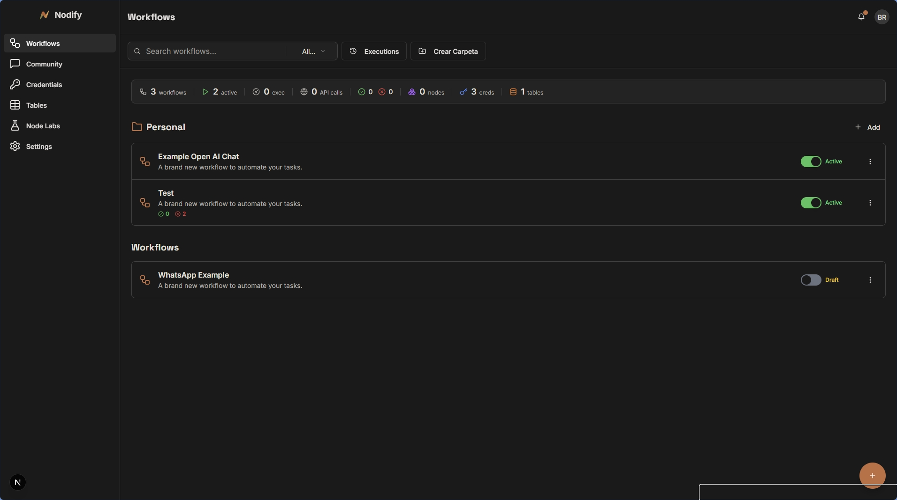
  <p><em>Manage all your workflows from a centralized dashboard. View active/inactive workflows, execution stats, and quick actions.</em></p>
</div>

**Features visible:**
- 📁 Workflow organization with folders (Personal, etc.)
- ⚡ Real-time status indicators (Active/Draft)
- 📈 Quick stats: Total workflows, active workflows, executions, API calls, nodes, credentials, and tables
- 🔍 Search and filter capabilities

---

### 🎨 Workflow Editor

<div align="center">
  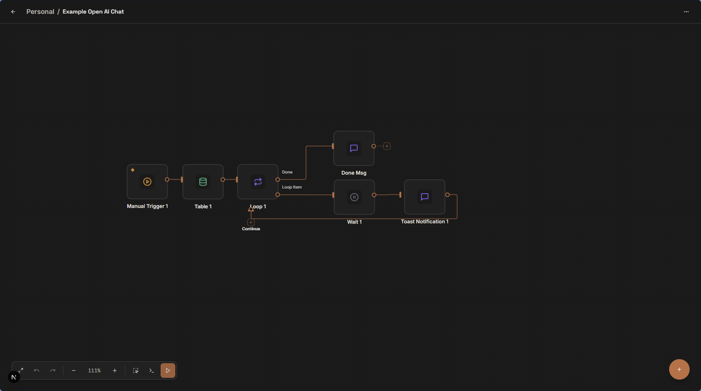
  <p><em>Drag-and-drop workflow editor powered by React Flow. Connect nodes to build complex automations visually.</em></p>
</div>

**Editor capabilities:**
- 🎯 Drag-and-drop node placement
- 🔗 Visual connection system with ports
- 🔄 Loop nodes for iteration
- ⏱️ Wait/delay nodes for timing control
- 💬 Toast notifications for user feedback
- 📝 Custom group stickers for organization

---

#### ▶️ Workflow Execution

<div align="center">
  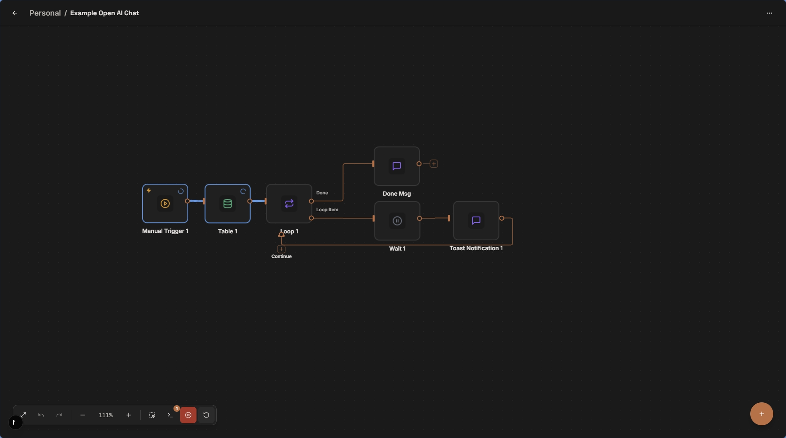
  <p><em>Execute workflows with visual feedback. See nodes light up as they execute, with real-time status indicators.</em></p>
</div>

**Execution features:**
- ▶️ **Play button** to run workflow manually
- 🔴 **Stop button** to cancel execution
- 💡 **Visual feedback** - Executing nodes highlighted in blue
- ⚡ **Real-time updates** as workflow runs
- 🎯 **Node-by-node execution** tracking
- 🔄 **Loop visualization** with iteration counts

---

### 🧩 Node Palette

<div align="center">
  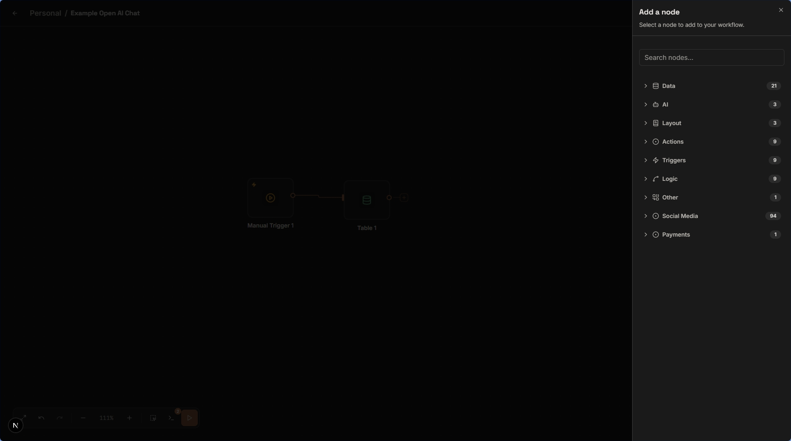
  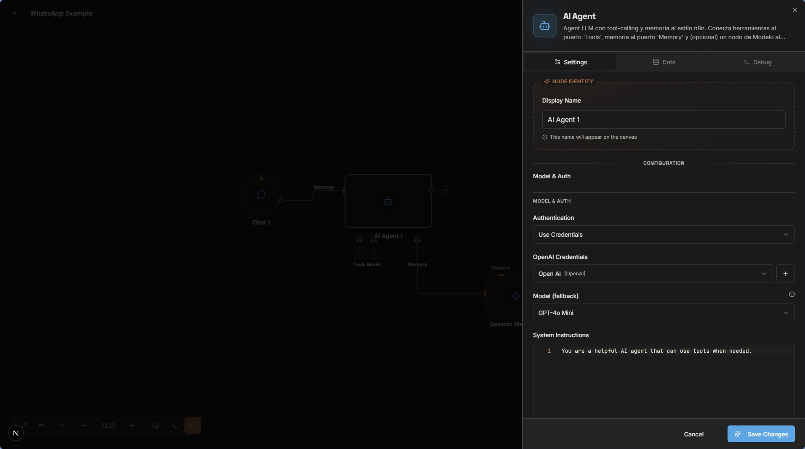
</div>

<p align="center"><em>Left: 100+ pre-built nodes organized by category. Right: Configure node properties with an intuitive interface.</em></p>

**Node Categories:**
- 📊 **Data** (21 nodes) - Transform, filter, merge, and manipulate data
- 🤖 **AI** (3 nodes) - AI agents, text generation, intelligent processing
- 🎨 **Layout** (3 nodes) - Group stickers and visual organization
- ⚙️ **Actions** (9 nodes) - HTTP requests, database operations, file handling
- ⚡ **Triggers** (9 nodes) - Webhooks, schedules, manual triggers
- 🔀 **Logic** (9 nodes) - IF/ELSE, Switch, loops, conditions
- 📱 **Social Media** (94 nodes) - WhatsApp, Discord, Telegram integrations
- 💳 **Payments** (1 node) - Payment processing
- 🔧 **Other** (1 node) - Miscellaneous utilities

---

#### 📱 Social Media Nodes

<div align="center">
  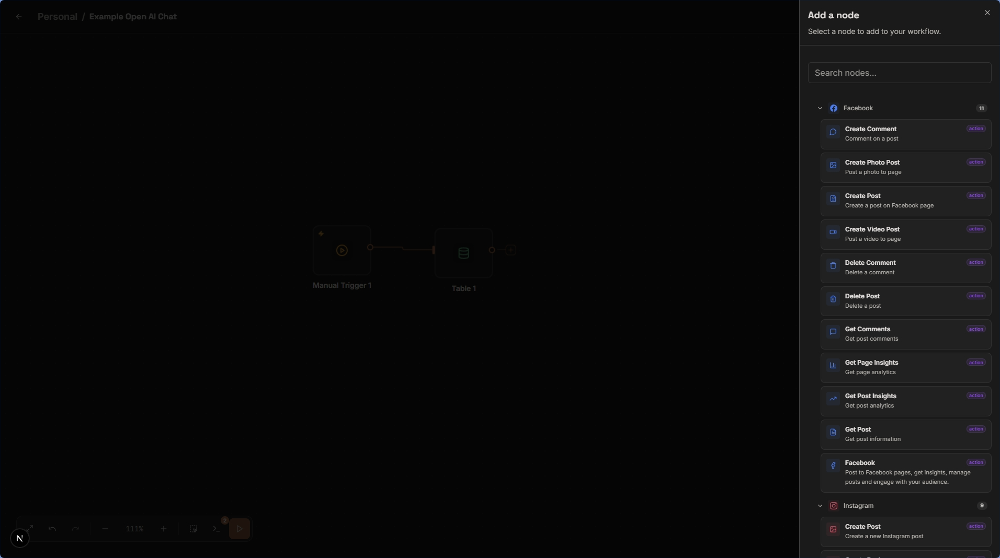
  <p><em>Extensive social media integration with 94 nodes for Facebook, Instagram, Twitter, LinkedIn, and more.</em></p>
</div>

**Facebook nodes include:**
- Create Comment, Create Photo Post, Create Post, Create Video Post
- Delete Comment, Delete Post
- Get Comments, Get Page Insights, Get Post Insights, Get Post
- And more...

**Instagram nodes include:**
- Create Post
- And many more integrations coming soon!

---

#### 📊 Node Data Inspector

<div align="center">
  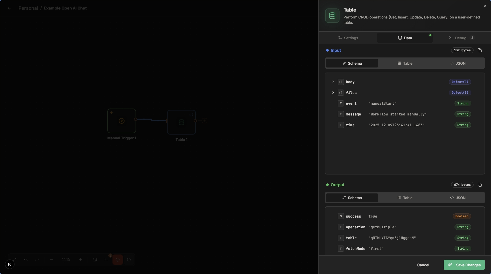
  <p><em>Inspect input and output data for each node with Schema, Table, and JSON views. Track data transformations through your workflow.</em></p>
</div>

**Data inspection features:**
- 📥 **Input data** view with byte size
- 📤 **Output data** view with byte size
- 🔍 **Schema view** - Expandable tree structure
- 📋 **Table view** - Tabular data representation
- 💻 **JSON view** - Raw JSON with syntax highlighting
- 📋 **Copy to clipboard** functionality

---

### 🐛 Debug Console

<div align="center">
  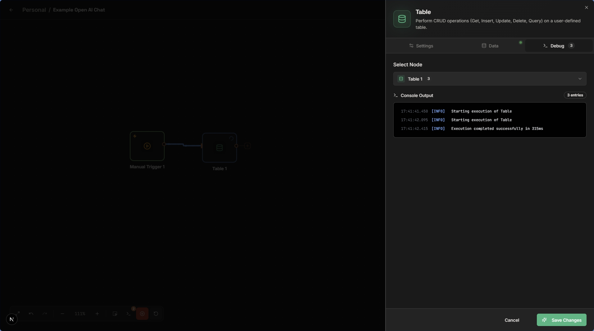
  <p><em>Real-time execution logs with timestamps, log levels, and detailed output for troubleshooting workflows.</em></p>
</div>

**Debug features:**
- 📝 Console output with log levels (INFO, LOG, WARN, ERROR)
- ⏱️ Precise timestamps (HH:MM:SS.mmm)
- 🔍 Per-node log filtering
- 📊 Execution duration tracking
- ✅ Success/failure indicators

---

### 💬 AI Chat Interface

<div align="center">
  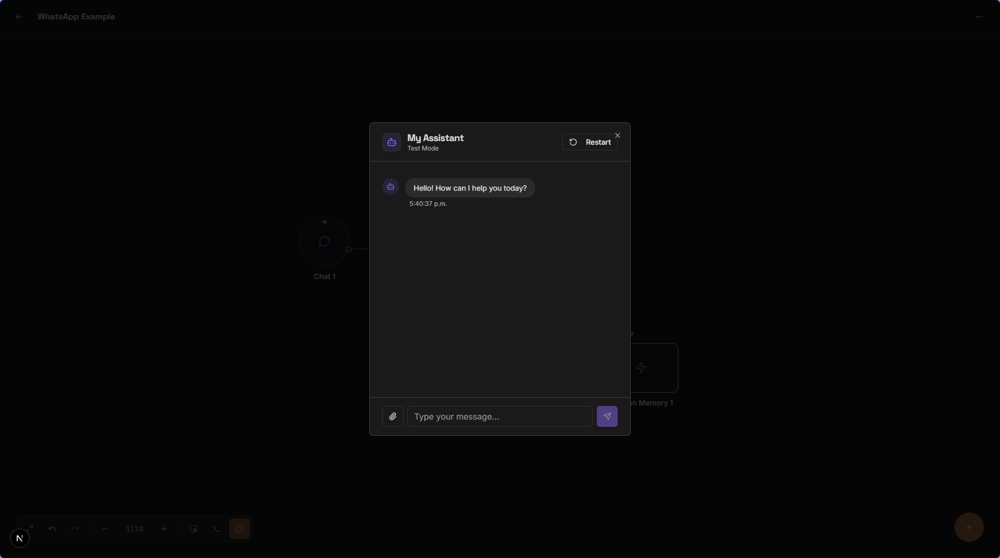
  <p><em>Interactive chat interface for testing AI-powered workflows with conversation history and restart capabilities.</em></p>
</div>

---

### 🔬 Node Labs - Custom Node Creator

<div align="center">
  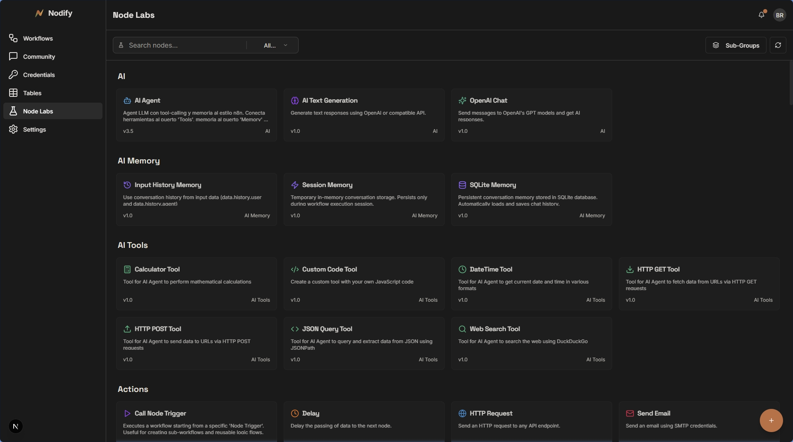
  <p><em>Browse and manage all your custom nodes. Organized by categories: AI, AI Memory, AI Tools, and Actions.</em></p>
</div>

<div align="center">
  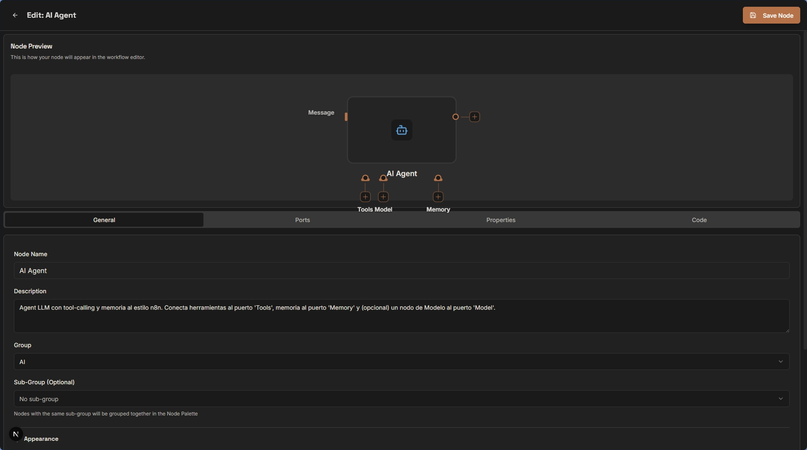
  <p><em>General tab: Configure node name, description, category, and visual appearance.</em></p>
</div>

<div align="center">
  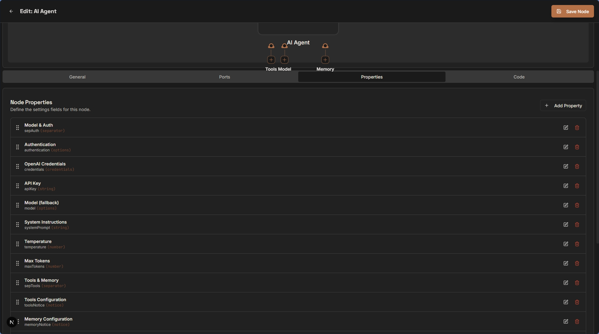
  <p><em>Properties tab: Define custom properties with types (separator, options, credentials, string, number, etc.).</em></p>
</div>

<div align="center">
  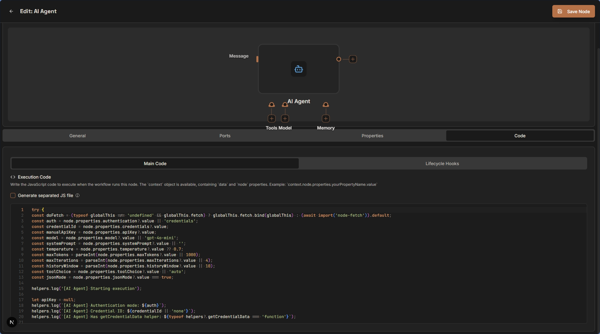
  <p><em>Code tab: Write JavaScript execution logic with full access to context, helpers, and node properties.</em></p>
</div>

**Node Labs capabilities:**
- 🎨 Visual node preview with real-time updates
- ⚙️ Custom properties configuration (10+ property types)
- 🔌 Input/output port definition with dynamic ports
- 💻 JavaScript execution code editor with syntax highlighting
- 🎭 Appearance customization (colors, icons, shapes)
- 📂 Category and sub-group organization
- 🔄 Lifecycle hooks support

**Available custom nodes:**
- **AI Nodes:** AI Agent, AI Text Generation, OpenAI Chat
- **AI Memory:** Input History Memory, Session Memory, SQLite Memory
- **AI Tools:** Calculator, Custom Code, DateTime, HTTP GET/POST, JSON Query, Web Search
- **Actions:** Call Node Trigger, Delay, HTTP Request, Send Email

---

### 🔑 Credentials Management

<div align="center">
  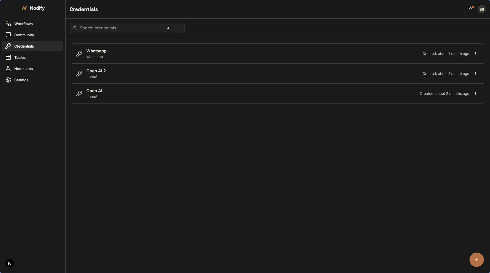
  <p><em>Securely store and manage API keys, tokens, and credentials for external services. Encrypted storage in Firestore.</em></p>
</div>

**Supported credential types:**
- 📱 WhatsApp API credentials
- 🤖 OpenAI API keys
- 🔧 Custom credential types

---

### 🗄️ Custom Tables

<div align="center">
  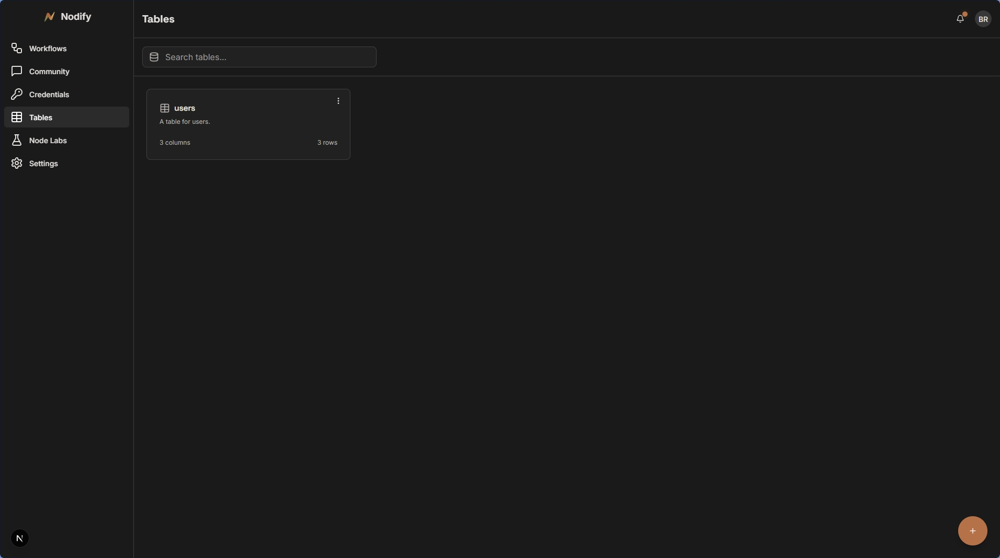
  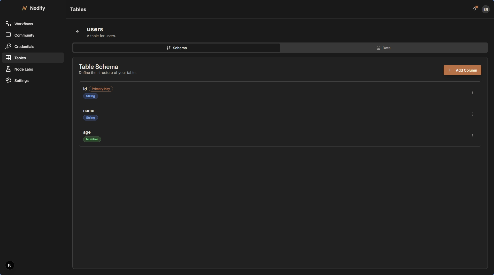
</div>

<p align="center"><em>Create and manage custom database tables with schema definitions. Perfect for storing workflow data.</em></p>

**Table features:**
- 📋 Schema definition with column types (String, Number, Boolean, etc.)
- 🔑 Primary key support
- 📊 Data tab for viewing/editing rows
- 🔍 Search and filter capabilities

---

### 📈 Execution History

<div align="center">
  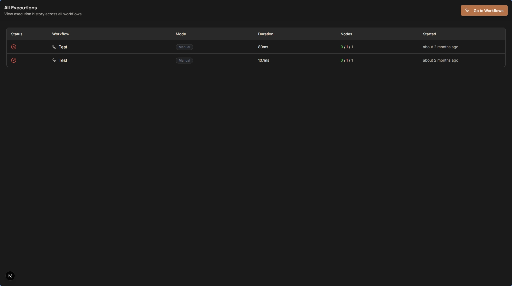
  <p><em>Track all workflow executions with detailed status, duration, mode, and node execution metrics.</em></p>
</div>

**Execution tracking:**
- ✅ Status indicators (Success/Error)
- ⏱️ Execution duration in milliseconds
- 🎯 Execution mode (Manual/Automatic/Webhook)
- 📊 Node execution count (e.g., 0/1/1 - errors/success/total)
- 📅 Timestamp for each execution

---

#### 📋 Execution Details

<div align="center">
  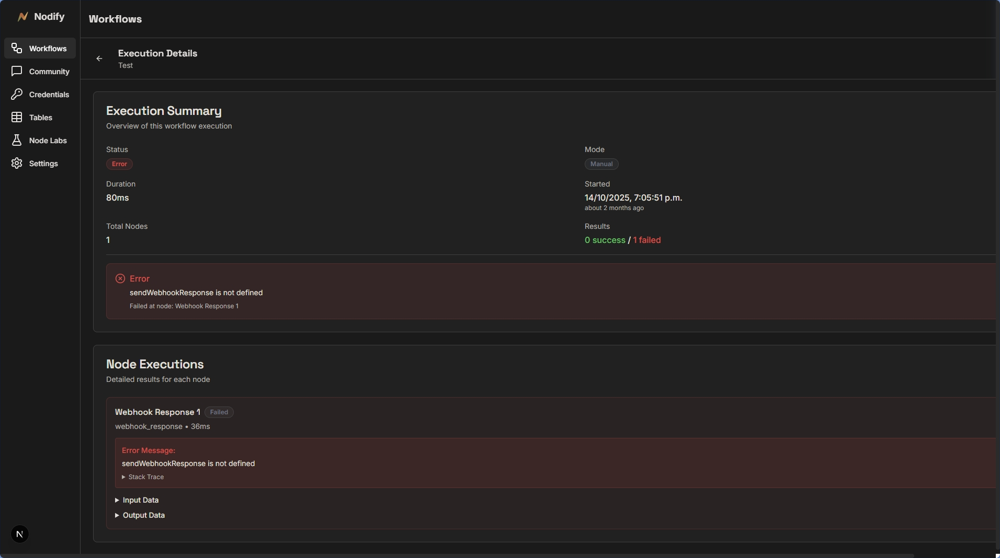
  <p><em>Detailed execution view with error messages, stack traces, and node-by-node results.</em></p>
</div>

**Detailed execution information:**
- 📊 **Execution Summary** - Status, duration, mode, started time, results
- ❌ **Error Display** - Clear error messages with node location
- 📚 **Stack Trace** - Full error stack for debugging
- 🔍 **Node Executions** - Individual node results
- 📥 **Input Data** - Expandable input data for each node
- 📤 **Output Data** - Expandable output data for each node
- ⏱️ **Per-node Duration** - Execution time for each node

---

### 👥 Community Dashboard

<div align="center">
  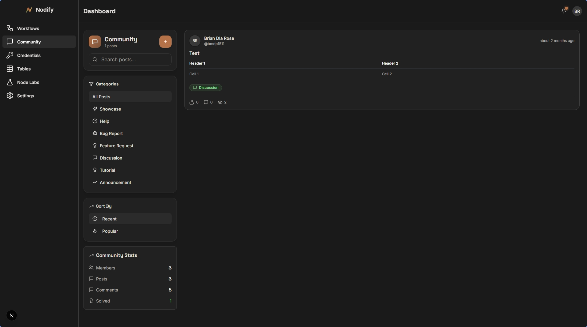
  <p><em>Share workflows, ask questions, and collaborate with the Nodify community.</em></p>
</div>

**Community features:**
- 📝 Discussion posts and threads
- 🏷️ Categories: Showcase, Help, Bug Report, Feature Request, Tutorial, Announcement
- 🔥 Popular and recent sorting
- 📊 Community stats (members, posts, comments, solved)
- 💬 Comments and engagement

---

### ⚙️ User Settings

<div align="center">
  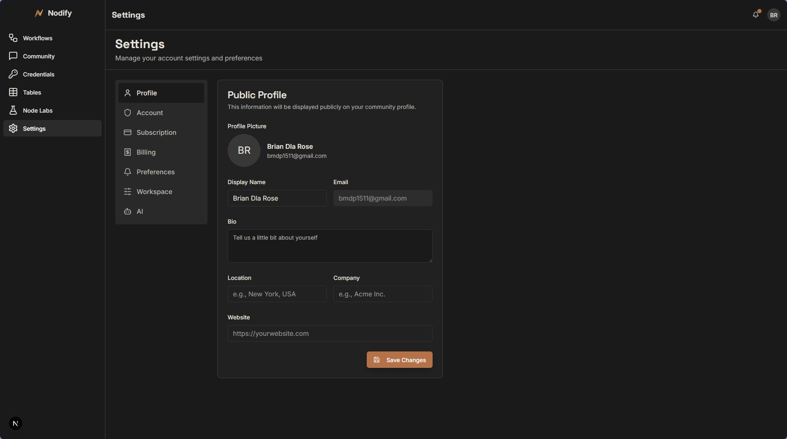
  <p><em>Manage your account settings and preferences. Customize your public profile for community interactions.</em></p>
</div>

**Settings sections:**
- 👤 **Profile** - Public profile information (display name, bio, location, company, website)
- 🔐 **Account** - Account security and credentials
- 💳 **Subscription** - Manage billing and subscription plans
- 💰 **Billing** - Payment methods and invoices
- 🔔 **Preferences** - Notification and app preferences
- 🏢 **Workspace** - Team and workspace management
- 🤖 **AI** - AI model settings and API keys

---

## ✨ Key Features

### 🎨 Visual Workflow Builder
- **Drag-and-drop interface** powered by React Flow
- **100+ pre-built nodes** across multiple categories
- **Custom node creator** (Node Labs) for building your own nodes
- **Group stickers** for visual organization
- **Real-time canvas** with zoom, pan, and alignment tools

### 🤖 AI Integration
- **AI Agent nodes** with tool-calling and memory support
- **Google Gemini 2.5 Flash** integration via Firebase Genkit
- **Custom AI tools** for enhanced agent capabilities
- **Multiple memory types** (session, input history, SQLite persistence)
- **Chat interface** for testing AI workflows

### 🔐 Security & Authentication
- **Firebase Authentication** for user management
- **Encrypted credentials storage** in Firestore
- **User-scoped data** - all data isolated per user
- **Firestore Security Rules** for data protection

### 📊 Data Management
- **Custom tables** with schema definitions
- **CRUD operations** via Table nodes
- **Real-time data sync** with Firestore
- **Data transformation nodes** for manipulation

### 🐛 Debugging & Monitoring
- **Real-time execution logs** with timestamps
- **Console output per node** with log levels
- **Execution history** with detailed metrics
- **Error tracking** and success indicators

### 🌐 Integrations
- **94+ social media nodes** (WhatsApp, Discord, Telegram)
- **HTTP Request nodes** for API calls
- **Webhook triggers** for external events
- **Email sending capabilities**
- **Payment processing** support

---

## 🏗️ Architecture

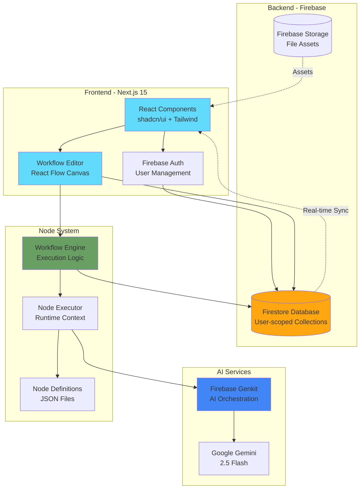
```mermaid
graph TB
    subgraph "Frontend - Next.js 15"
        UI[React Components<br/>shadcn/ui + Tailwind]
        Editor[Workflow Editor<br/>React Flow Canvas]
        Auth[Firebase Auth<br/>User Management]
    end

    subgraph "Backend - Firebase"
        Firestore[(Firestore Database<br/>User-scoped Collections)]
        Storage[(Firebase Storage<br/>File Assets)]
    end

    subgraph "AI Services"
        Genkit[Firebase Genkit<br/>AI Orchestration]
        Gemini[Google Gemini<br/>2.5 Flash]
    end

    subgraph "Node System"
        NodeDefs[Node Definitions<br/>JSON Files]
        Engine[Workflow Engine<br/>Execution Logic]
        Executor[Node Executor<br/>Runtime Context]
    end

    UI --> Editor
    UI --> Auth
    Editor --> Engine
    Engine --> Executor
    Executor --> NodeDefs

    Auth --> Firestore
    Editor --> Firestore
    Engine --> Firestore

    Executor --> Genkit
    Genkit --> Gemini

    Firestore -.Real-time Sync.-> UI
    Storage -.Assets.-> UI

    style UI fill:#61dafb
    style Editor fill:#61dafb
    style Firestore fill:#ffa611
    style Genkit fill:#4285f4
    style Engine fill:#68a063
```

### 🔧 Technology Stack

**Frontend:**
- ⚛️ **React 19** - UI library
- ⚡ **Next.js 15** - React framework with App Router
- 📘 **TypeScript 5.x** - Type-safe development
- 🎨 **Tailwind CSS** - Utility-first styling
- 🧩 **shadcn/ui** - Beautiful component library
- 🌊 **React Flow** - Node-based workflow canvas
- ✨ **Framer Motion** - Smooth animations
- 💻 **CodeMirror** - In-node code editing

**Backend:**
- 🔥 **Firebase Authentication** - User auth
- 🗄️ **Cloud Firestore** - NoSQL database
- 📦 **Firebase Storage** - File storage
- 🤖 **Firebase Genkit** - AI orchestration
- 🧠 **Google Gemini 2.5 Flash** - AI model

**Development:**
- 📦 **npm** - Package management
- 🔨 **TypeScript** - Type checking
- 🧹 **ESLint** - Code linting
- 🚀 **Turbopack** - Fast bundling
- 🔄 **GitHub Actions** - CI/CD

---

## 🚀 Getting Started

### Prerequisites

- **Node.js** 18+ (20.x recommended)
- **npm** 9+
- **Firebase project** with Firestore and Authentication enabled
- **Google AI API key** (for Gemini integration)

### Installation

1️⃣ **Clone the repository**
```bash
git clone https://github.com/nodify0/Nodify.git
cd Nodify
```

2️⃣ **Install dependencies**
```bash
npm ci
```

3️⃣ **Set up environment variables**

Create a `.env.local` file in the root directory:

```env
# Webhooks & Security
WEBHOOK_SECRET_TOKEN=your_webhook_secret
CRON_SECRET=your_cron_secret

# Firebase Client Configuration
NEXT_PUBLIC_FIREBASE_API_KEY=your_api_key
NEXT_PUBLIC_FIREBASE_AUTH_DOMAIN=your_project.firebaseapp.com
NEXT_PUBLIC_FIREBASE_PROJECT_ID=your_project_id
NEXT_PUBLIC_FIREBASE_STORAGE_BUCKET=your_project.appspot.com
NEXT_PUBLIC_FIREBASE_MESSAGING_SENDER_ID=your_sender_id
NEXT_PUBLIC_FIREBASE_APP_ID=your_app_id

# Firebase Admin (Server-side)
FIREBASE_STORAGE_BUCKET=your_project.appspot.com
FIREBASE_SERVICE_ACCOUNT_BASE64=your_base64_encoded_service_account_json

# Google AI (Gemini)
GEMINI_API_KEY=your_gemini_api_key
```

4️⃣ **Run the development server**
```bash
npm run dev
```

The application will start on **http://localhost:9003** 🎉

---

## 📜 Available Scripts

| Command | Description |
|---------|-------------|
| `npm run dev` | Start Next.js dev server on port 9003 (Turbopack) |
| `npm run build` | Build the application for production |
| `npm start` | Start the production server |
| `npm run lint` | Run ESLint for code quality checks |
| `npm run typecheck` | Type-check TypeScript without emitting files |
| `npm run genkit:dev` | Start Genkit AI development server |
| `npm run genkit:watch` | Start Genkit with watch mode |

---

## 📁 Project Structure

```
Nodify/
├── src/
│   ├── app/                    # Next.js App Router
│   │   ├── (auth)/             # Auth routes (login, register)
│   │   ├── (app)/              # Protected application routes
│   │   │   ├── workflows/      # Workflow list and editor
│   │   │   ├── tables/         # Custom database tables
│   │   │   ├── credentials/    # Credential management
│   │   │   ├── node-labs/      # Custom node creator
│   │   │   └── settings/       # User settings
│   │   └── api/                # API routes
│   ├── components/
│   │   ├── ui/                 # shadcn/ui components
│   │   └── workflow/           # Workflow editor components
│   ├── nodes/                  # Node definitions (JSON files)
│   ├── lib/                    # Utilities and helpers
│   ├── hooks/                  # Custom React hooks
│   ├── firebase/               # Firebase config and hooks
│   ├── ai/                     # Genkit AI flows
│   └── schemas/                # Validation schemas
├── docs/                       # Project documentation
│   ├── images/                 # Screenshots and assets
│   └── *.md                    # Documentation files
├── public/                     # Static assets
├── scripts/                    # Maintenance scripts
└── firestore.rules             # Firestore security rules
```

---

## 💡 Core Concepts

### 🔄 Workflows

Workflows are the heart of Nodify. Each workflow consists of:
- **Nodes** - Individual units of work (triggers, actions, logic gates)
- **Connections** - Edges connecting node outputs to inputs
- **Status** - `active`, `inactive`, or `draft`
- **Execution Context** - Runtime data passed between nodes

### 🧩 Nodes

Nodes are defined as JSON files in `src/nodes/`. Each node includes:

```json
{
  "id": "webhook",
  "name": "Webhook",
  "description": "Trigger workflow via HTTP webhook",
  "category": "trigger",
  "properties": [...],
  "inputs": [...],
  "outputs": [...],
  "executionCode": "// JavaScript code",
  "appearance": {
    "color": "#10b981",
    "icon": "Webhook",
    "shape": "rounded"
  }
}
```

**Node execution context:**
```javascript
// Available in executionCode:
context.data          // Output from previous node
context.node.properties  // Current node configuration
helpers.log()         // Log to Debug tab
helpers.warn()        // Log warnings
helpers.error()       // Log errors
```

### 🎨 Group Stickers

Special visual containers for organizing workflows:
- Can contain multiple child nodes
- Resizable with custom background colors
- Always render behind regular nodes (z-index: 0)

### 🔬 Custom Nodes (Node Labs)

Create your own nodes with:
- **Custom properties** (text, numbers, dropdowns, JSON)
- **Input/output ports** for data flow
- **JavaScript execution code**
- **Visual customization** (colors, icons, shapes)
- **Category organization**

---

## 📚 Usage Examples

### Example 1: Simple HTTP Workflow

```
[Manual Trigger] → [HTTP Request] → [Transform Data] → [Toast Notification]
```

1. Add a **Manual Trigger** node
2. Connect to an **HTTP Request** node (configure API endpoint)
3. Add a **Transform Data** node to process the response
4. Finish with a **Toast Notification** to display results
5. Click "Execute" to run the workflow

### Example 2: AI-Powered Chat Bot

```
[Webhook] → [AI Agent] → [Response]
           ↓
      [Memory Node]
```

1. Create a **Webhook** trigger for incoming messages
2. Add an **AI Agent** node with Gemini model
3. Connect **Session Memory** for conversation context
4. Configure response formatting
5. Deploy and test via webhook URL

### Example 3: Data Processing Pipeline

```
[Schedule Trigger] → [Table Query] → [Loop] → [Transform] → [HTTP POST]
                                      ↓ (for each)
                                   [Filter]
```

1. Use a **Schedule Trigger** for periodic execution
2. Query data from a **Custom Table**
3. **Loop** through each record
4. **Filter** based on conditions
5. **Transform** and **POST** to external API

---

## 🤝 Contributing

Contributions are welcome! Please follow these guidelines:

### Development Workflow

1. 🍴 **Fork the repository**
2. 🌿 **Create a feature branch**
   ```bash
   git checkout -b feature/amazing-feature
   ```
3. 💻 **Make your changes**
4. ✅ **Run checks**
   ```bash
   npm run lint
   npm run typecheck
   ```
5. 📝 **Commit with Conventional Commits**
   ```bash
   git commit -m "feat: add amazing feature"
   ```
   - `feat:` - New features
   - `fix:` - Bug fixes
   - `docs:` - Documentation changes
   - `chore:` - Maintenance tasks
   - `refactor:` - Code refactoring
   - `test:` - Adding tests

6. 🚀 **Push to your fork**
   ```bash
   git push origin feature/amazing-feature
   ```
7. 🎉 **Open a Pull Request**

### Code Style

- ✨ TypeScript + React
- 🎨 Tailwind CSS for styling
- 📏 2-space indentation
- 🔗 Path aliases: `@/*` → `./src/*`
- 📦 Use existing component patterns

---

## 🔒 Security

- 🔐 **Never commit secrets** - Use `.env.local` for sensitive data
- 🛡️ **Firestore Security Rules** - All data scoped to `/users/{userId}/`
- 🔑 **Encrypted credentials** - API keys stored securely in Firestore
- 🚪 **Auth required** - All routes protected by Firebase Authentication

### Firestore Data Structure

```
/users/{userId}
  /workflows/{workflowId}
    - name: string
    - nodes: Node[]
    - connections: Connection[]
    - status: 'active' | 'inactive' | 'draft'

  /credentials/{credentialId}
    - name: string
    - type: string
    - data: encrypted

  /tables/{tableId}
    - name: string
    - schema: object[]
    - rows: object[]

  /notifications/{notificationId}
    - message: string
    - timestamp: Date
```

---

## 🎯 Roadmap

- [ ] 🌐 WebSocket support for real-time triggers
- [ ] ⏰ Advanced scheduling with cron expressions
- [ ] 🛒 Workflow templates marketplace
- [ ] 👥 Multi-user collaboration features
- [ ] 📦 Workflow versioning and rollback
- [ ] 📊 Performance monitoring and analytics
- [ ] 🔌 More integrations (Slack, Discord, GitHub, Notion)
- [ ] 📱 Mobile app for workflow monitoring
- [ ] 🌍 Multi-language support (i18n)
- [ ] 🎓 Interactive tutorials and onboarding

---

## 📄 License

No license specified. Please add a license file if you plan to make this repository public.

---

## 🙏 Acknowledgments

Built with amazing open-source technologies:

- [Next.js](https://nextjs.org/) - The React Framework
- [React Flow](https://reactflow.dev/) - Node-based workflow canvas
- [shadcn/ui](https://ui.shadcn.com/) - Beautiful UI components
- [Tailwind CSS](https://tailwindcss.com/) - Utility-first CSS
- [Firebase](https://firebase.google.com/) - Backend infrastructure
- [Google Gemini](https://ai.google.dev/) - AI capabilities
- [Framer Motion](https://www.framer.com/motion/) - Animations
- [CodeMirror](https://codemirror.net/) - Code editor

---

## 💬 Support

- 📧 **Email:** support@nodify.app (if available)
- 🐛 **Issues:** [GitHub Issues](https://github.com/nodify0/Nodify/issues)
- 💬 **Discussions:** [GitHub Discussions](https://github.com/nodify0/Nodify/discussions)
- 📖 **Documentation:** [docs/](docs/)

---

<div align="center">

  **⭐ Star us on GitHub — it motivates us a lot!**

  Made with ❤️ by the Nodify team

  [⬆ Back to top](#nodify)

</div>
